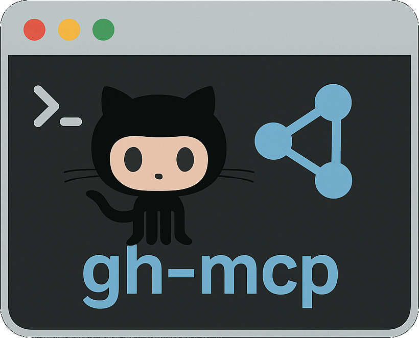

# GitHub CLI MCP 

<div align="center">
  
  <p><em>Use GitHub CLI commands directly from Claude and other AI assistants</em></p>
</div>

A server that enables AI assistants to interact with GitHub repositories through the Model Context Protocol (MCP).

## ⚡ Quick Start

```bash
# Prerequisites: Node.js v18+ and GitHub CLI installed and authenticated

# Install globally
npm install -g gh-cli-mcp

# Start the server
gh-cli-mcp
```

## 📖 Documentation

Visit our [GitHub Wiki](https://github.com/CodingButterBot/gh_cli_mcp/wiki) for complete documentation:

- [Installation Guide](https://github.com/CodingButterBot/gh_cli_mcp/wiki/Installation)
- [Usage Guide](https://github.com/CodingButterBot/gh_cli_mcp/wiki/Usage)
- [Configuration](https://github.com/CodingButterBot/gh_cli_mcp/wiki/Configuration)
- [Available Tools](https://github.com/CodingButterBot/gh_cli_mcp/wiki/Available-Tools)
- [FAQ](https://github.com/CodingButterBot/gh_cli_mcp/wiki/FAQ)

## 📊 Key Features

- Use GitHub CLI commands in AI assistants like Claude
- Create, view and manage pull requests
- Work with issues and repositories
- Run and monitor GitHub workflows
- Simple stdio integration for any MCP-compatible AI assistant

## 📄 License

MIT

---

<div align="center">
  <a href="https://codingbutterbot.github.io/gh_cli_mcp/">Website</a> |
  <a href="https://github.com/CodingButterBot/gh_cli_mcp/">GitHub</a> |
  <a href="https://www.npmjs.com/package/gh-cli-mcp">npm</a>
</div>